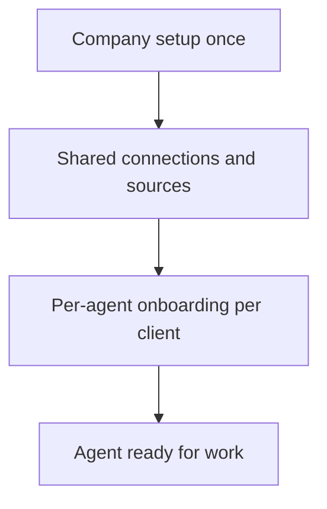

# Per-agent onboarding

**September 16, 2026.** Company setup stays shared. Agent onboarding does not.

Each of the 32 specialists has its own onboarding process, required tools, and a per-client stored record. Completing the company briefing does not onboard a specialist. Selecting Account Intelligence must not reuse Outbound Email SDR’s Instantly, CSV, and Calendly flow. Swapping a specialist reuses company connections and shows **that** agent’s remaining setup.

Executable sources of truth:

- Catalog tools, capabilities, and prerequisites: `packages/agents/src/index.ts`
- Full-role systems: `agentSystemRequirements` in `packages/domain/src/company-connections.ts`
- Per-client store: `public.agent_onboarding` (migration `202609160029_agent_onboarding.sql`)
- Domain snapshot: `packages/domain/src/agent-onboarding.ts`

Older conversational, guided, and six-section onboarding documents describe **company** flows. Check their dates; they are not per-agent onboarding.

## Two layers

| Layer | Scope | What it stores | What it does not mean |
| --- | --- | --- | --- |
| Company | Once per client workspace | Identity, website/facts, people, operating rules, connected systems in `onboarding_documents`, `connections`, and `source_bindings` | Any specialist is ready to work |
| Agent | Once per specialist, per client | That role’s checklist, required tools, unique inputs, and status in `agent_onboarding` | Company connections were copied or the questionnaire must restart |

Tenant rule: **one database, isolated by `workspace_id`**. There is not a separate Postgres per client. `installations` is operational status (mode, capacity, pause), not onboarding. Agent-specific runtime tables stay: `outbound_*` remains Outbound Email SDR campaign state; `agent_onboarding` is the onboarding envelope for all 32.

Connect-once Connections ([company connection setup](COMPANY_CONNECTION_SETUP.md)) still apply. Agent onboarding binds those shared sources to a specialist and collects anything that specialist alone needs.

## Persistence

`public.agent_onboarding` is keyed by `(workspace_id, agent_id)`:

| Column | Role |
| --- | --- |
| `status` | `not_started`, `in_progress`, `blocked`, or `ready` |
| `answers` | Agent-specific collected fields (empty until that agent’s UI fills them) |
| `required_tools` | Snapshot of tools, capabilities, systems, and prerequisites |
| `missing` | Current blockers for this client |
| `revision` | Optimistic concurrency for saves |

Creating a workspace or selecting a specialist ensures a row exists for every catalog agent. Swapping a specialist does not delete company connections or other agents’ onboarding rows. Seed data for `required_tools` lives in `private.agent_required_tools` and must stay aligned with the TypeScript catalog.

Workspace members can read rows. Owners and assigned operators mutate through `save_agent_onboarding`. Distinct onboarding UIs ship agent-by-agent in the 1/32 review; later work fills `answers` instead of inventing another one-off store.

## Distinct examples

**Preparation specialists** (Account Intelligence, Search Growth, Technical SEO Monitor, Creative Performance, Landing Page Optimizer, Social Content Publisher, Video Script Producer, Local Search Manager, Website Sales Concierge). Confirm the captured website snapshot and company facts. Tools: `read_approved_snapshot`, `save_artifact`. No extra provider onboarding beyond Connections. First work is a reviewed artifact. Copy-out is complete delivery when a destination CMS or social account is missing.

**Deal Follow-up.** Bind a current proposals sheet, Gmail send and reply-read, and an enrolled cohort. Tools: `read_bound_source`, `propose_checked_action`. Company website capture is not this agent’s onboarding.

**Appointment Coordinator.** Bind calendar free/busy and booking plus a reviewed conversation handoff. Tools: `read_bound_source`, `propose_checked_action`.

**Outbound Email SDR.** Customer-supplied list, booking URL, Instantly warmup. Tools: `instantly.campaign`, `instantly.leads`, `instantly.webhooks`. Runtime stays in `outbound_campaigns` / `outbound_leads` / `outbound_events`. This agent does not find leads.

## Catalog map

`Current tools` are what the implemented or piloted mode actually calls. `Full-role systems` are the complete responsibility, including integrations that are not built yet. Planned agents still get an `agent_onboarding` row so each client has the envelope before engineering ships.

| ID | Onboarding unique to this role | Current tools | Full-role systems | Extra persistence |
| --- | --- | --- | --- | --- |
| account-intelligence | Confirm website snapshot and facts; review a WebsiteProfile | `read_approved_snapshot`, `save_artifact` | website, drive | `prepared_artifacts` |
| buying-signal-scout | Name analytics and proposal sources; engineering still required | none (planned) | analytics, proposals | `agent_onboarding` only |
| outbound-email-sdr | Lead CSV, booking URL, Instantly warmup; no SuperSearch | `instantly.campaign`, `instantly.leads`, `instantly.webhooks` | mail | `outbound_*` |
| linkedin-outreach-assistant | Review notes for HeyReach copy-out; no LinkedIn send | `heyreach.copy_out` | social, proposals | copy-out artifact |
| partner-development | Identify partner records and mailbox owner; engineering still required | none (planned) | proposals, mail | `agent_onboarding` only |
| rfp-opportunity-scout | Record RFP sources and file access; engineering still required | none (planned) | rfp, drive | `agent_onboarding` only |
| competitor-intelligence | Confirm competitor pages in the approved snapshot; engineering still required | none (planned) | website | `agent_onboarding` only |
| search-growth | Confirm website facts; review a ContentBrief | `read_approved_snapshot`, `save_artifact` | website, analytics | `prepared_artifacts` |
| technical-seo-monitor | Confirm captured pages only; no GSC or CMS write-back | `read_approved_snapshot`, `save_artifact` | website | `prepared_artifacts` |
| local-search-manager | Confirm locations; review a LocationChecklist | `read_approved_snapshot`, `save_artifact` | local, website | `prepared_artifacts` |
| creative-performance | Confirm offer/audience facts; review AdCopyConcepts | `read_approved_snapshot`, `save_artifact` | advertising, drive | `prepared_artifacts` |
| paid-campaign-operator | Record ad accounts and analytics; engineering still required | none (planned) | advertising, analytics | `agent_onboarding` only |
| landing-page-optimizer | Confirm website facts; review a PageCopyHypothesis | `read_approved_snapshot`, `save_artifact` | website, analytics | `prepared_artifacts` |
| social-content-publisher | Confirm facts; review a SocialDraft; publishing unavailable | `read_approved_snapshot`, `save_artifact` | social, drive | `prepared_artifacts` |
| video-script-producer | Confirm facts; review a VideoScript; rendering unavailable | `read_approved_snapshot`, `save_artifact` | drive | `prepared_artifacts` |
| product-merchandiser | Commerce catalog access; engineering still required | none (planned) | commerce | `agent_onboarding` only |
| speed-to-lead-responder | Inbound lead source and mailbox; engineering still required | none (planned) | proposals, mail | `agent_onboarding` only |
| ai-receptionist | Call routing and calendar; engineering still required | none (planned) | calls, calendar | `agent_onboarding` only |
| website-sales-concierge | Confirm website facts; review a FaqDraft; embed not deployed | `read_approved_snapshot`, `save_artifact` | website, drive | `prepared_artifacts` |
| appointment-coordinator | Calendar free/busy and book; conversation handoff | `read_bound_source`, `propose_checked_action` | calendar, mail | `appointments`, `conversations` |
| lead-qualification | Proposal/inquiry source; engineering still required | none (planned) | proposals | `agent_onboarding` only |
| proposal-operations | Proposal files and current records; engineering still required | none (planned) | proposals, drive | `agent_onboarding` only |
| deal-follow-up | Current proposals sheet, Gmail send/read, enrolled cohort | `read_bound_source`, `propose_checked_action` | proposals, mail | `actions`, `approvals`, `receipts` |
| sales-call-coach | Call recordings and files; engineering still required | none (planned) | calls, drive | `agent_onboarding` only |
| estimate-recovery | Home-service jobs and mailbox; engineering still required | none (planned) | proposals, mail | `agent_onboarding` only |
| revenue-experiment-manager | Analytics and payment evidence; engineering still required | none (planned) | analytics, payments | `agent_onboarding` only |
| abandoned-cart-recovery | Commerce and mail; engineering still required | none (planned) | commerce, mail | `agent_onboarding` only |
| lifecycle-email-manager | Mailbox and customer records; engineering still required | none (planned) | mail, proposals | `agent_onboarding` only |
| customer-win-back | Closed records and mailbox; engineering still required | none (planned) | proposals, mail | `agent_onboarding` only |
| expansion-opportunity-scout | Accounts and payments; engineering still required | none (planned) | proposals, payments | `agent_onboarding` only |
| renewal-and-retention | Renewal records and payments; engineering still required | none (planned) | proposals, payments | `agent_onboarding` only |
| review-and-referral-manager | Listings, reviews, and mailbox; engineering still required | none (planned) | local, mail | `agent_onboarding` only |

Website Sales Concierge is included with every workspace and still has its own onboarding row. It does not consume a paid slot.

Computed per-agent readiness remains in `onboardingReport()`. Stored `status` on `agent_onboarding` is the client envelope; live readiness still requires current sources, permissions, and (where implemented) a reviewed artifact or provider receipt.
